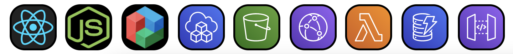

# nodeblog.app

## Available at: https://nodeblog.app

### A node blog made using TypeScript, React, Node & AWS Serverless with CDK. This is a monorepo comprised of three projects:

- **backend**: api layer with node running on aws lambda
- **frontend**: client side app with react
- **infra**: deployment infrastructure with cdk

### Tech stack

### In order of appearance:

#### React, Node, Blueprint, Amazon CDK, Amazon S3, Amazon CloudFront, Amazon Lambda, Amazon DynamoDB, Amazon API Gateway
